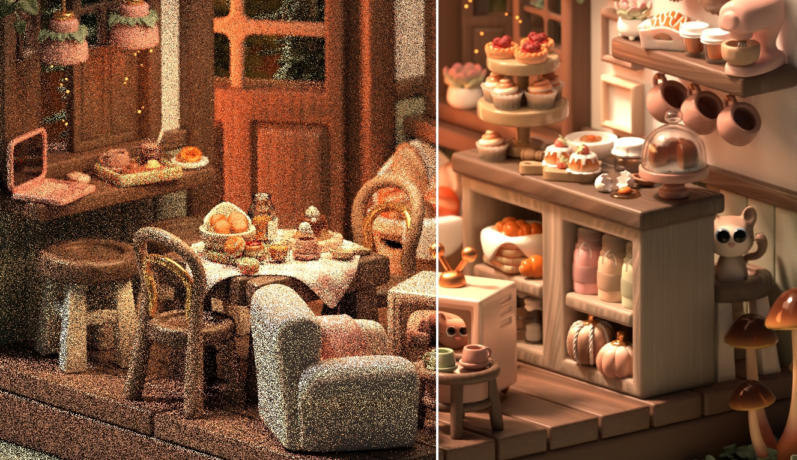
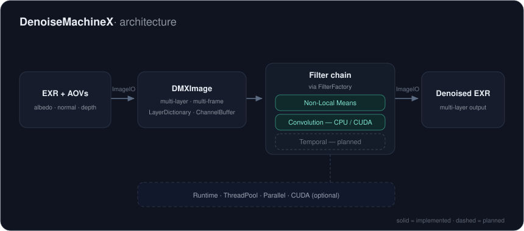

# Denoise Machine X

[](https://github.com/ginzburg-dev/denoise-machine-x/actions/workflows/linux_build_and_test.yaml)
[](LICENSE)

**A modular C++20 denoising plugin system for production rendering pipelines.**

Denoise Machine X (DMX) is being built as a common production layer for classical and neural denoisers. It separates image representation, filtering algorithms, execution backends, and host integration so that new methods can be added without rebuilding the entire pipeline around them.

The repository currently provides a tested multi-layer, multi-frame image core, OpenEXR I/O, CPU Non-Local Means, and CPU/CUDA convolution. The end-to-end CLI, temporal processing, neural backends, and DCC integrations are still under development.

<p align="center">
  
</p>

<p align="center">
  <sub>
    <strong>Split comparison:</strong> low-sample Monte Carlo render (left) and denoised result (right).<br>
    Based on <a href="https://www.blender.org/download/demo/splash/blender-3.5-splash.blend">Blender 3.5 — Cozy Kitchen</a>
    by <a href="https://www.artstation.com/nickyblender">Nicole Morena</a>.
    Rendered, denoised, and assembled by Dmitri Ginzburg.
    Derived image licensed under <a href="https://creativecommons.org/licenses/by-sa/4.0/">CC BY-SA 4.0</a>.
  </sub>
</p>

## Why DMX

Production denoising is more than a single filter. A usable system must move multi-layer EXR data through algorithms, CPU and GPU backends, frame sequences, render-farm jobs, and artist-facing tools while preserving a consistent data model.

DMX is designed around that separation:

- **Images are algorithm-independent.** `DMXImage` stores multiple frames and named layers without tying them to one denoiser.
- **Filters are interchangeable.** `FilterFactory` creates filters from parameter dictionaries behind a shared interface.
- **Execution is explicit.** Filters can select CPU, CUDA, and supporting runtime resources such as a thread pool.
- **Host code stays thin.** CLI, DCC, render-farm, Python, and service integrations can translate their inputs into the same core API.

## Project evolution

**2016–2020 · [Ginzburg Denoiser](https://github.com/ginzburg-dev/ginzburg-denoiser)** — The original deterministic spatiotemporal denoiser. It shipped as a standalone application and Foundry Nuke plug-in and was used in animation production.

**2024–present · [Ginzburg Neural Denoiser](https://github.com/ginzburg-dev/ginzburg-neural-denoiser)** — The data-driven research project, including guidance-aware temporal denoising, public baselines, evaluation tools, and a standalone C++/CUDA inference engine.

**2025–present · Denoise Machine X** — The modular production architecture intended to bring classical and neural filters into one extensible system for command-line, render-farm, and DCC workflows.

## Current status

DMX is under active development. The core components and spatial filters can be exercised directly and are covered by tests; the command-line application does not yet connect them into a complete denoising workflow.

| Area | Available now | Planned |
|---|---|---|
| Image I/O | Multi-layer OpenEXR read/write | Additional formats and sequence-level I/O |
| Image model | Multi-layer, multi-frame `DMXImage` and non-owning `DMXImageView` | Higher-level sequence management |
| Spatial filtering | AOV-guided Non-Local Means on CPU; convolution on CPU | Additional classical filters |
| GPU | CUDA convolution | CUDA Non-Local Means and more GPU backends |
| Temporal | Multi-frame storage | Motion-aware temporal filtering |
| Application | Argument/config parsing in progress | Complete CLI pipeline |
| Integration | Core abstractions | Nuke/OFX, Blender, Maya/Houdini, Python, and service adapters |

## Architecture

<p align="center">
  
</p>

OpenEXR images and renderer AOVs are loaded into `DMXImage`. Filters operate on selected layers and frames through a shared interface, while the thread pool and optional CUDA backend provide execution resources. The same core is intended to sit behind different host adapters.

```text
Nuke / OFX plug-in ──────┐
Blender add-on ──────────┤
Maya / Houdini tools ────┤
CLI / render-farm job ───┼── host adapter ── DMX core ── denoised output
Python pipeline tool ────┤
Service / worker ────────┘
```

These adapters are part of the roadmap.

## Implemented components

- OpenEXR / Imath image I/O
- `DMXImage`, `DMXImageView`, `LayerDictionary`, and `ChannelBuffer`
- Layer- and frame-selective filtering
- AOV-guided CPU Non-Local Means using beauty, albedo, normal, and depth layers when available
- CPU and CUDA convolution
- Runtime filter registration through `FilterFactory`
- `ThreadPool` and parallel execution helpers
- Typed parameter dictionaries, logging, build information, and argument parsing
- GoogleTest suite and Linux CI

## Build and test

### Requirements

- A C++20 compiler
- CMake 3.26+
- Git and network access during the first configure
- CUDA Toolkit only for CUDA builds

OpenEXR, Imath, and GoogleTest are fetched at pinned versions by CMake; separate system installations are not required by the current build.

### CPU build

```bash
git clone https://github.com/ginzburg-dev/denoise-machine-x.git
cd denoise-machine-x

cmake -S . -B build -DBUILD_CUDA=OFF -DBUILD_TESTING=ON
cmake --build build --parallel
ctest --test-dir build --output-on-failure
```

### CUDA build

```bash
cmake -S . -B build-cuda \
  -DBUILD_CUDA=ON \
  -DBUILD_TESTING=ON \
  -DCMAKE_CUDA_ARCHITECTURES=native

cmake --build build-cuda --parallel
ctest --test-dir build-cuda --output-on-failure
```

The repository also provides platform presets. List them with:

```bash
cmake --list-presets
```

For example, the Linux CPU configuration used by CI can be reproduced with:

```bash
cmake --preset linux-cpu-debug
cmake --build --preset linux-cpu-debug
ctest --preset linux-cpu-debug
```

## Repository layout

```text
include/dmxdenoiser/   public headers and core types
src/                   image, I/O, filter, and runtime implementations
cli/dmxdenoiser/       command-line application under development
tests/                 unit and integration tests
examples/              sample EXR inputs
config/                configuration examples
docs/img/              README artwork and diagrams
```

## Roadmap

- Wire parsing, image I/O, filter creation, and output into the complete CLI pipeline
- Add motion-aware temporal filtering
- Add CUDA Non-Local Means
- Integrate neural inference as another filter backend
- Package the core as a reusable library/SDK
- Build thin adapters for Nuke/OFX and other DCC or pipeline hosts
- Add reproducible image-quality and performance benchmarks

## License

The source code is licensed under the [Apache License 2.0](LICENSE).

Third-party and derived visual assets retain their own licenses. See [THIRD_PARTY_ASSETS.md](THIRD_PARTY_ASSETS.md).

---

**Dmitri Ginzburg** · [GitHub](https://github.com/ginzburg-dev) · [LinkedIn](https://www.linkedin.com/in/ginzburg-cg)
